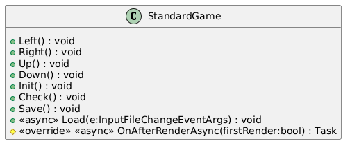

Blazing 2048!
=============

Funkční specifikace
-------------------

### Popis

Aplikace umožňuje hraní hry 2048 v prohlížeči. Uživateli bude umožněno:

*   Vytvořit novou hru
*   Provést tah pomocí šipek na klávesnici nebo kláves WASD
*   Dostat upozornění o výhře (dosažení 2048) nebo prohře (nelze provést žádný tah)
*   Automaticky načítat a ukládat hru z/do LocalStorage po každém tahu
*   Načítat a ukládat hru z/do souboru

Rozšířená (extended) verze hry nabídne navíc:

*   Hrát hru na jiném poli než 4x4
*   Hrát hru na asymetrickém poli
*   Měnit počet nově vytvořených dlaždic po validním tahu

### Uživatelské role

Aplikace obsahuje pouze roli uživatele, kterému je umožněno provést vše, co aplikace nabízí.

### UseCase diagram

### Uživatelské rozhraní

Největší část UI bude zaujímat hrací pole. Pod hracím polem budou umístěna tlačítka pro obsluhu hry, tj. zejména:

*   Restart
*   Uložení hry do souboru
*   Načtení hry ze souboru

Rozšířená (extended) verze ještě nabídne možnost zvolit parametry hry. Volba bude provedena pomocí dropdownu (HTML Select). Změna stavu herního pole bude provedena animovaně pomocí plynulého přechodu ze starého na nový stav (s využitím CSS animací).

Technická specifikace
---------------------

### Logika

Aplikace bude napsána MV (model-view) architekturou s použitím OOP. View (zde reprezentován kódem v Razor syntaxi, tj. mix HTML a C#) bude mít přístup k instanci modelu (resp. k instanci standardní nebo rozšířené hry). Uživatelské vstupy od View (stisky kláves a tlačítek) budou předány modelu pomocí volání jeho metod s příslušnými parametry.

### Data

Instance hry bude obsahovat zejména následující datové položky:

*   herní pole (reprezentováno jako dvourozměrné pole integerů)
*   skóre
*   stav o výhře nebo prohře hry
*   pro rozšířenou hru její parametry: rozměry herního pole a počet nových dlaždic při validním pohybu

### Algoritmus

Algoritmicky nejvýznamnější metodou je metoda Move() ve třídě Game. Pohyb herí desky se provede následujícím způsobem:

1.  Extrakce řádku (pro pohyb vodorovně) nebo sloupce (pro pohyb svisle)
2.  Odstranění nul (prázdných polí)
3.  Seskupení shodných dlaždic
4.  Vyplnění zbytku pole nulami (prázdným polem)
5.  Nahrání upraveného řádku nebo sloupce zpět do herní desky

Kontrola výhry hry se provede prohledáním herního pole. Je-li nalezeno pole o hodnotě 2048, hra je vyhraná.

Kontrola prohry se provede "pokusnými" tahy do všech čtyřech směrů. Jestliže ani jeden pohyb není validní (nedojde při něm ke změně herního pole), hra je prohraná.

### Class diagram logiky

### Class diagram view

### Technické aspekty

Aplikace je napsána v Blazoru nastaveném do režimu renderování u klienta. Blazor umožňuje psaní logiky webové aplikace v C# (a značnou přenositelnost kódu mezi backendovou aplikací, frontendovou aplikací a mobilní aplikací), avšak některé věci (zde zejména animování a zachytávání událostí) je stále nutné dělat pomocí JavaScriptu. Grafický návrh aplikace a rozložení je vytvořeno v CSS (Flex), animace změny stavu je vytvořená pomocí animací (keyframes).

Třída Game je základní třídou pro datovou a funkční logiku hry. Od ní dědí třídy StandardGame a ExtendedGame, které si samy vytváří vlastní konstruktor. Statická třída AuxMethods obsahuje pouze pomocné statické metody (zejm. pro I/O).

Aplikace je zkompilována do WASM (WebAssembly), proto se po spuštění dlouho načítá a je poměrně veliká (20 MB).

### Použité programátorské techniky, OOP

*   C#, JS, CSS, Razor (C#/HTML)
*   Model-View
*   Dědičnost, modifikátor přístupu protected
*   Gettery a settery s rozdílným modifikátorem přístupu (public get, private nebo protected set)
*   Vícero konstruktorů (prázdný a textový)
*   Zabezpečení přenosu (zde primitivní kontrolní součet u souboru a LocalStorage)
*   Předefinování metod následníkem (override)
*   Statická třída se statickými metodami (oddělení, zpřehlednění aplikace)
*   Asynchronní metody (zejm. pro interoperabilitu C# a JavaScriptu)